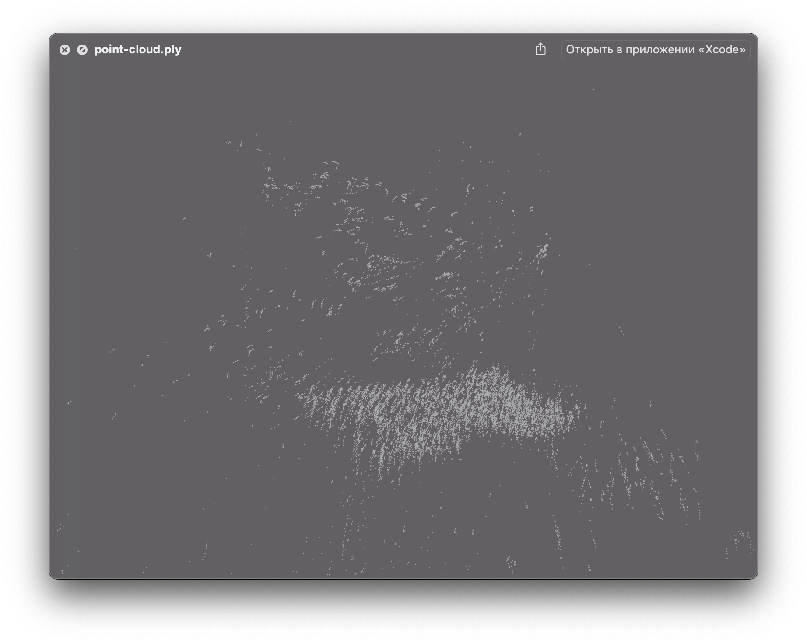
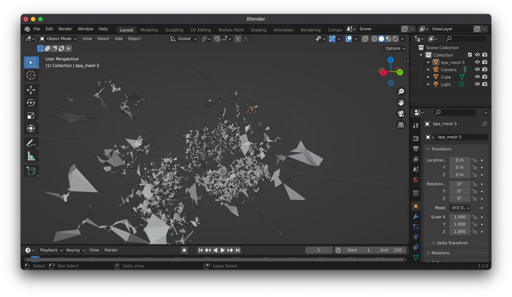

# Goal

The goal was to make a 3D model from what the default (non lidar) camera of iPhone sees, for example a 3D model of a room

# How I implemented it

I managed to get feature points which `ARKit` uses to locate device in space. On this step you already can export them via `.ply` format, but i decided to go deeper. I used a c++ library called [Open3D](https://github.com/isl-org/Open3D) with python layer over it through `PythonKit` on device to create a mesh from feauture points. The [ball pivoting algorithm](https://vgc.poly.edu/~csilva/papers/tvcg99.pdf) (this thing still blows my mind) was used to make it possible.

# The results

The results are unsatisfactory. Because the amount of points is very big, the computation takes too much time. Also the resulting mesh is very imprecise because the accuracy of digital triangulation (which i get from ARKit on device without lidar) is low.

||
|:-:|
|*Point cloud from ARKit visualized*|

||
|:-:|
|*Mesh result from ball pivoting algorithm*|

# Further improvements

- Try to validate ARKit point cloud to improve accuracy
- Minimize the computation time but still keep it on device